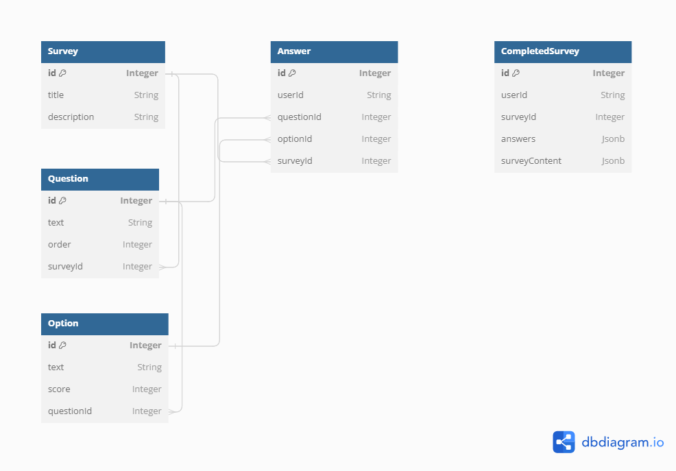

# Survey Service

## 사용 기술
- Node.js
- NestJS
- TypeScript
- GraphQL
- TypeORM
- PostgreSQL
- Docker (optional)

## 기능
- 설문지 CRUD
- 문항 CRUD
- 선택지 CRUD
- 답변 CRUD
- 설문지 완료 및 완료된 설문지 확인
- 완료된 설문지 조회 API

객관식 설문지의 데이터 베이스 설계
- 답변별 점수가 존재한다.
  1. 패키지 여행 - 0점
  2. 자유여행 - 1점
  3. 테마 여행 - 2점
        
- 설문지는 답변을 체크할 수 있다.
- 답변의 총점을 확인할 수 있다.


## 환경 설정
```env
# .env 파일 예시
DB_HOST=localhost
DB_PORT=5432
DB_USERNAME=username
DB_PASSWORD=password
DB_DATABASE=survey
APP_PORT=4000
```

## 빌드 및 실행 방법

```bash
# 필요한 패키지 설치
npm install

# 서버 실행
npm run start
```

## 빌드 및 실행 방법 (Docker)

1. Docker 네트워크 생성
```
docker network create survey_network
```
2. Docker 이미지 빌드
```
docker-compose build
```
3. Docker 컨테이너 실행
```
docker-compose up -d
```

---

## 테이블 설계

### 설문지 테이블 (Survey)

| 컬럼 이름     | 데이터 타입      | 설명                 |
|:------------:|:---------------:|:-------------------|
| id           | bigint(20)      | Primary Key, Auto Increment |
| title        | varchar(255)    | 설문지 제목            |
| description  | text            | 설문지 설명 (선택적)     |

### 문항 테이블 (Question)

| 컬럼 이름     | 데이터 타입      | 설명                    |
|:------------:|:---------------:|:----------------------|
| id           | bigint(20)      | Primary Key, Auto Increment |
| text         | varchar(255)    | 문항 내용               |
| order        | int             | 문항 순서               |
| survey_id    | bigint(20)      | Foreign Key (Survey)   |

### 선택지 테이블 (Option)

| 컬럼 이름     | 데이터 타입      | 설명                    |
|:------------:|:---------------:|:----------------------|
| id           | bigint(20)      | Primary Key, Auto Increment |
| text         | varchar(255)    | 선택지 내용              |
| score        | int             | 점수                   |
| question_id  | bigint(20)      | Foreign Key (Question) |

### 답변 테이블 (Answer)

| 컬럼 이름     | 데이터 타입      | 설명                     |
|:------------:|:---------------:|:-----------------------|
| id           | bigint(20)      | Primary Key, Auto Increment |
| user_id      | varchar(255)    | 유저 식별자                |
| question_id  | bigint(20)      | Foreign Key (Question)  |
| option_id    | bigint(20)      | Foreign Key (Option)    |
| survey_id    | bigint(20)      | Foreign Key (Survey)    |

### 완료된 설문지 테이블 (CompletedSurvey)

| 컬럼 이름     | 데이터 타입      | 설명                           |
|:------------:|:---------------:|:-----------------------------|
| id           | bigint(20)      | Primary Key, Auto Increment   |
| user_id      | varchar(255)    | 유저 식별자                      |
| survey_id    | bigint(20)      | 설문지 식별자 (Foreign Key)       |
| answers      | json            | 사용자의 답변 (JSON 형식)         |
| survey_content | json          | 완료 시점의 설문지 내용 (JSON 형식) |

---

### 데이터 관계

- `Survey` 엔티티는 여러 `Question` 엔티티를 포함합니다.
- 각 `Question`은 하나의 `Survey`에 속하며 여러 `Option`을 가집니다.
- `Option`은 특정 `Question`에 속합니다.
- `Answer`는 사용자의 답변을 나타내며, 특정 `Question`과 `Option`에 연결됩니다.
- `CompletedSurvey`는 사용자가 완료한 설문지를 나타내며, 해당 사용자의 답변과 설문지 내용을 저장합니다.


---
## API 문서 (GraphQL Playground)
http://localhost:4000/graphql

---
## API 설명

### Survey 관련 API
```
type Survey {
  id: ID!
  title: String!
  description: String
}

type Query {
  surveys: [Survey!]!
}

type Mutation {
  createSurvey(createSurveyInput: CreateSurveyInput!): Survey!
  updateSurvey(updateSurveyInput: UpdateSurveyInput!): Survey!
  removeSurvey(id: ID!): Boolean!
}

input CreateSurveyInput {
  title: String!
  description: String
}

input UpdateSurveyInput {
  id: ID!
  title: String
  description: String
}
```
#### 설문지 생성 (새로운 설문지를 생성합니다.)

#### 설문지 업데이트 (기존 설문지를 업데이트합니다.)

#### 설문지 삭제 (특정 설문지를 삭제합니다.)

#### 모든 설문지 조회 (모든 설문지를 조회합니다.)

### Question 관련 API
```
type Question {
  id: ID!
  text: String!
  order: Float!
  options: [Option!]
}

type Query {
  questionsBySurvey(surveyId: ID!): [Question!]!
}

type Mutation {
  createQuestion(createQuestionInput: CreateQuestionInput!): Question!
  updateQuestion(updateQuestionInput: UpdateQuestionInput!): Question!
  removeQuestion(id: ID!): Boolean!
}

input CreateQuestionInput {
  surveyId: ID!
  text: String!
  order: Float!
}

input UpdateQuestionInput {
  id: ID!
  text: String
  order: Float
}
```
#### 문항 생성 (새로운 문항을 생성합니다.)

#### 문항 업데이트 (기존 문항을 업데이트합니다.)

#### 문항 삭제 (특정 문항을 삭제합니다.)

#### 특정 설문지의 모든 문항 조회 (특정 설문지에 속한 모든 문항을 조회합니다.)

### Option 관련 API
```
type Option {
  id: ID!
  text: String!
  score: Float!
}

type Query {
  optionsByQuestion(questionId: ID!): [Option!]!
}

type Mutation {
  createOption(createOptionInput: CreateOptionInput!): Option!
  updateOption(updateOptionInput: UpdateOptionInput!): Option!
  removeOption(id: ID!): Boolean!
}

input CreateOptionInput {
  questionId: ID!
  text: String!
  score: Float!
}

input UpdateOptionInput {
  id: ID!
  text: String
  score: Float
}
```
#### 선택지 생성 (새로운 선택지를 생성합니다.)

#### 선택지 업데이트 (기존 선택지를 업데이트합니다.)

#### 선택지 삭제 (특정 선택지를 삭제합니다.)

#### 특정 문항의 모든 선택지 조회 (특정 문항에 속한 모든 선택지를 조회합니다.)

### Answer 관련 API
```
type Answer {
  id: ID!
  userId: String!
  option: Option!
}

type Query {
  answers(userId: String!, surveyId: ID!, questionId: ID): [Answer!]!
}

type Mutation {
  createAnswer(createAnswerInput: CreateAnswerInput!): Answer!
  updateAnswer(updateAnswerInput: UpdateAnswerInput!): Answer!
  removeAnswer(id: ID!): Boolean!
}

input CreateAnswerInput {
  questionId: ID!
  optionId: ID!
  userId: String!
}

input UpdateAnswerInput {
  id: ID!
  optionId: ID!
}
```
#### 답변 생성 또는 업데이트 (새로운 답변을 생성하거나 기존 답변을 업데이트합니다.)

#### 답변 업데이트 (기존 답변을 업데이트합니다.)

#### 답변 삭제 (특정 답변을 삭제합니다.)

#### 특정 사용자의 답변 조회 (특정 사용자의 모든 답변 또는 특정 설문지 또는 문항에 대한 답변을 조회합니다.)

### CompeltedSurvey 관련 API
```
type CompletedSurvey {
  id: ID!
  userId: String!
  answers: String!
  surveyContent: String!
}

type Query {
  completedSurveys(userId: String!): [CompletedSurvey!]!
}

type Mutation {
  createCompletedSurvey(
    createCompletedSurveyInput: CreateCompletedSurveyInput!
  ): CompletedSurvey!
}

input CreateCompletedSurveyInput {
  userId: String!
  surveyId: ID!
}
```
#### 설문지 완료 (설문지의 모든 내용과 답변을 저장합니다.)

#### 완료된 설문지 조회 (완료된 설문지를 조회합니다.)

